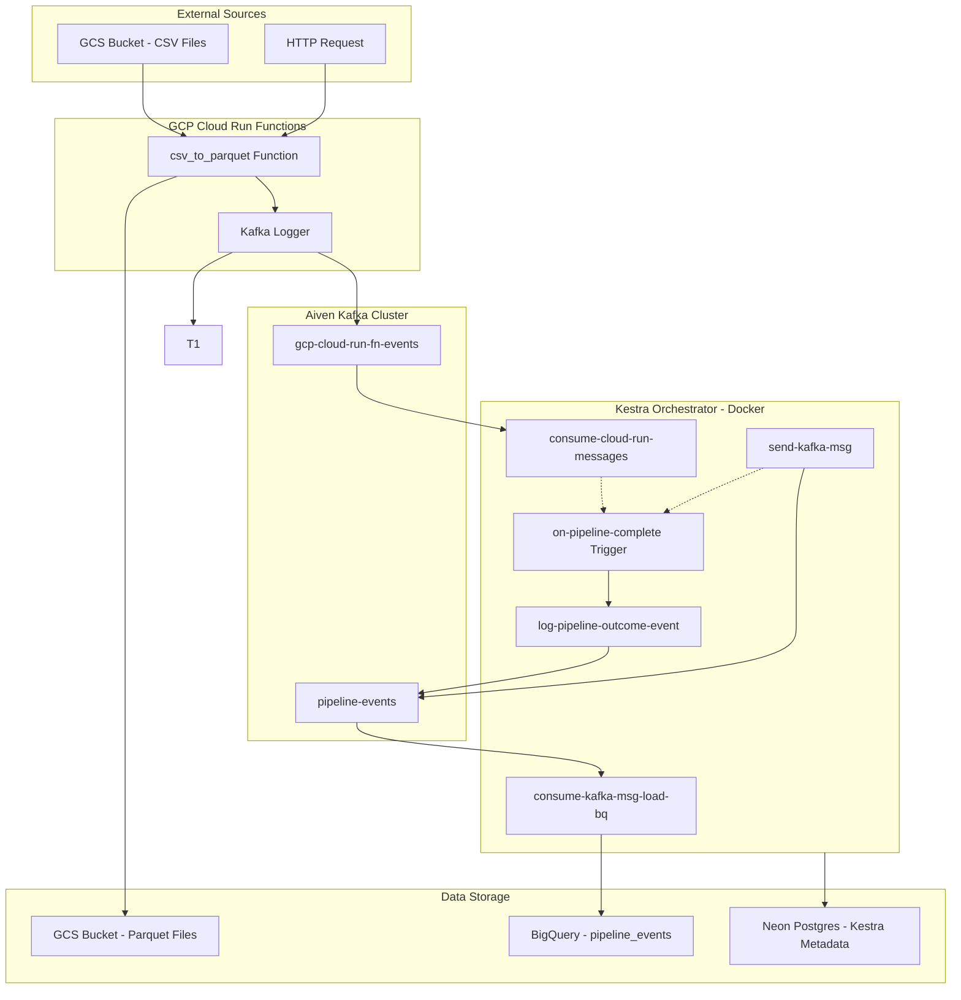
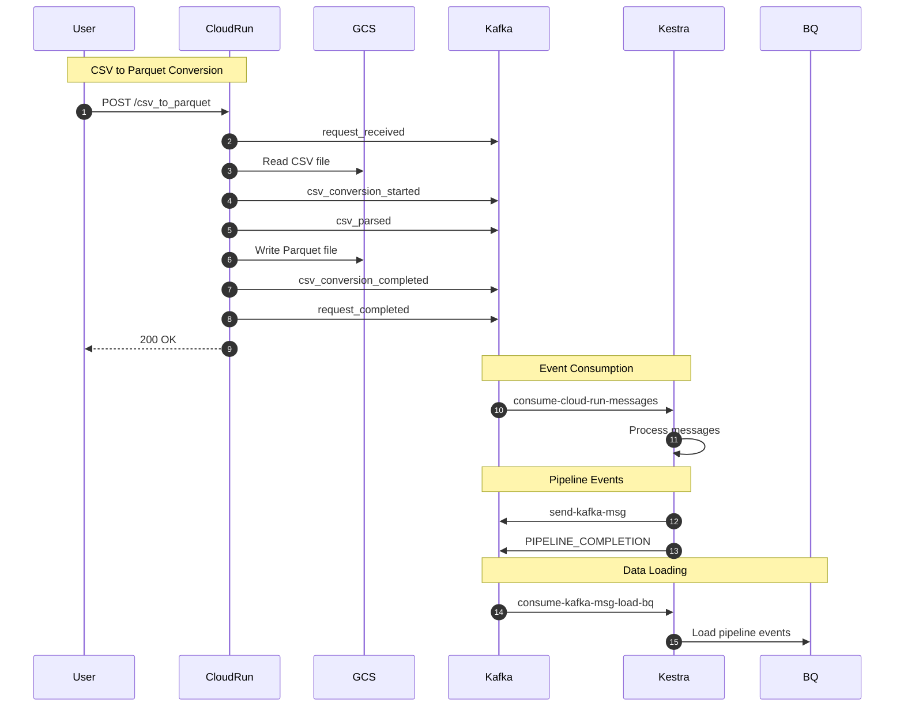

# Event Driven Data Pipeline observability with Kafka

## Project Summary

This repository demonstrates a robust **data observability and processing pipeline** integrating **Kestra**, **Aiven Kafka**, and **Google Cloud Platform (GCP)**. It showcases an end-to-end, serverless event-driven architecture where:

*   **GCP Cloud Run Functions** automatically convert uploaded CSV files into optimized Parquet format.
*   **Aiven Kafka** streams real-time events from the conversion process.
*   **Kestra Orchestrator** manages the workflow, consuming Kafka events, initiating downstream tasks, and loading processed data into **BigQuery**.
*   **Auditing & Observability** are built-in, tracking every step from file upload to data warehousing.

This project serves as a reference implementation for building scalable, event-driven data pipelines with modern tools.

---

This document outlines all events generated by containers and orchestrators in the **Kestra-Aiven Observability** pipeline, along with a visual flow diagram.

---

## Architecture Overview

The system consists of three main components:

| Component | Description |
|-----------|-------------|
| **GCP Cloud Run Functions** | Serverless containers that convert CSV to Parquet files |
| **Aiven Kafka** | Managed Kafka cluster for event streaming |
| **Kestra Orchestrator** | Workflow orchestration running in Docker |

---

## Events Generated

### 1. Cloud Run Functions (Container Events)

The `cloud-run-functions/main.py` generates the following events to Kafka:

| Event Type | Description | Data Fields |
|------------|-------------|-------------|
| `kafka_producer_initialized` | Kafka producer successfully connected | `status`, `bootstrap_servers` |
| `request_received` | HTTP request received by the function | `request_id`, `method`, `content_type` |
| `conversion_request` | CSV to Parquet conversion initiated | `request_id`, `csv_uri`, `output_uri` |
| `csv_conversion_started` | Conversion process started | `csv_uri`, `output_uri` |
| `csv_parsed` | CSV file successfully parsed | `csv_uri`, `rows`, `columns`, `column_names`, `dtypes` |
| `csv_conversion_completed` | Conversion completed successfully | `csv_uri`, `output_uri`, `rows`, `columns` |
| `csv_conversion_failed` | Conversion failed with error | `csv_uri`, `output_uri`, `error`, `traceback` |
| `request_completed` | HTTP request completed successfully | `request_id`, `response` |
| `request_failed` | HTTP request failed | `request_id`, `error`, `traceback` |

**Target Kafka Topic:** `gcp-cloud-run-fn-events` (configurable via `KAFKA_TOPIC` env var)

---

### 2. Kestra Orchestrator (Flow Events)

#### 2.1 Pipeline Events (Namespace: `aiven`)

**Flow: `send-kafka-msg`**
- **Purpose:** Send custom messages to Kafka
- **Events Produced:** Custom JSON messages to `pipeline-events` topic

**Flow: `consume-cloud-run-messages`**
- **Purpose:** Consume events from Cloud Run functions
- **Events Consumed:** From `gcp-cloud-run-fn-events` topic
- **Output:** `messages.json` file

**Flow: `consume-kafka-msg-load-bq`**
- **Purpose:** Consume pipeline events and load to BigQuery
- **Events Consumed:** From `pipeline-events` topic  
- **Output:** Loads data to BigQuery table

#### 2.2 Audit Events (Namespace: `audit`)

**Flow: `log-pipeline-outcome-event`**
- **Purpose:** Log pipeline execution outcomes to Kafka
- **Events Produced:**
  - `PIPELINE_COMPLETION` - When any pipeline completes
  - Custom events with fields: `event`, `status`, `timestamp`, `executionId`, `source_flowId`, `source_namespace`
- **Target Topic:** `pipeline-events`

**Flow: `on-pipeline-complete`**
- **Purpose:** Trigger audit logging on flow completion
- **Trigger Conditions:**
  - Flow execution status: `SUCCESS`, `FAILED`, `WARNING`
  - Namespace filter: `aiven`
- **Events Produced:**
  - `PIPELINE_COMPLETION` event with execution metadata

---

## Kafka Topics

| Topic Name | Producer | Consumer |
|------------|----------|----------|
| `gcp-cloud-run-fn-events` | Cloud Run Functions | Kestra: `consume-cloud-run-messages` |
| `pipeline-events` | Kestra: `send-kafka-msg`, `log-pipeline-outcome-event` | Kestra: `consume-kafka-msg-load-bq` |

---
## Data Flow Walkthrough


https://github.com/user-attachments/assets/7f807946-2ed4-4faa-a01e-c6eb3137dea5


## Event Flow Diagram



---

## Detailed Event Flow Sequence



---

## Event Schema Examples

### Cloud Run Event
```json
{
  "event_type": "csv_conversion_completed",
  "timestamp": "2026-01-25T08:30:00.000000",
  "data": {
    "csv_uri": "gs://bucket/data/input.csv",
    "output_uri": "gs://bucket/parquet/input_20260125083000.parquet",
    "rows": 10000,
    "columns": 15
  }
}
```

### Pipeline Completion Event
```json
{
  "event": "PIPELINE_COMPLETION",
  "status": "SUCCESS",
  "timestamp": "2026-01-25T08:35:00.000000Z",
  "executionId": "abc123",
  "source_flowId": "consume-cloud-run-messages",
  "source_namespace": "aiven"
}
```

---

## Infrastructure Summary

| Component | Technology | Deployment |
|-----------|------------|------------|
| Cloud Run Functions | Python 3.11, DuckDB | GCP Cloud Run |
| Kafka Cluster | Aiven Kafka | Managed (SSL) |
| Orchestrator | Kestra | Docker Compose |
| Metadata DB | PostgreSQL | Neon (Serverless) |
| Data Warehouse | BigQuery | GCP |
| Object Storage | GCS | GCP |

---

## Docker Task Runners

Kestra uses **Docker task runners** for executing Python scripts:

```yaml
taskRunner:
  type: io.kestra.plugin.scripts.runner.docker.Docker
  image: python:3.11-slim
```

This ensures:
- Isolated execution environment
- Consistent dependencies via `beforeCommands`
- SSL certificates mounted as `inputFiles`
